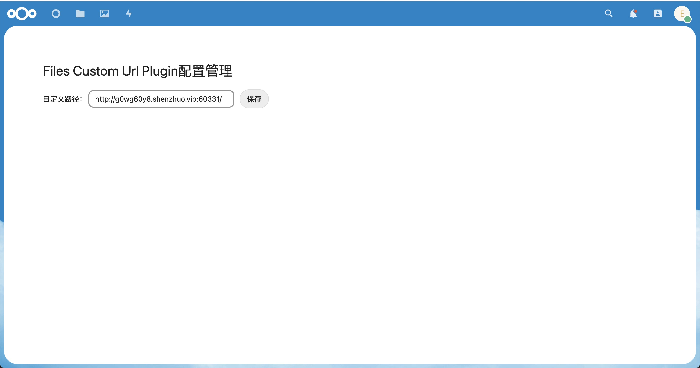

# File Custom Url Plugin

一个自定义文件链接的files app插件，启用后该插件后，将会在files的菜单提供额外的按钮，用于解决在内网中使用nextcloud时，文件下载/分享链接以内网主机地址作为前缀的问题。

该插件的运行流程非常简单，将存储于服务器的链接读取、与前端的分享链接拼接，并复制到粘贴板。

注意，自定义链接必须可以通过公网访问，否则这么做没什么意义。

## 管理面板

启用插件后，打开链接“http://你的域名/nextcloud/index.php/apps/files_custom_url_plugin/”可看到如下界面。

（页面比较简单，且仅包含一个保存链接的功能）

