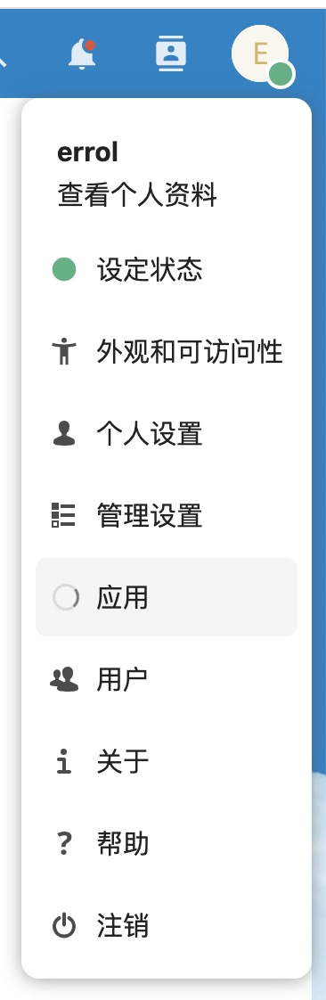
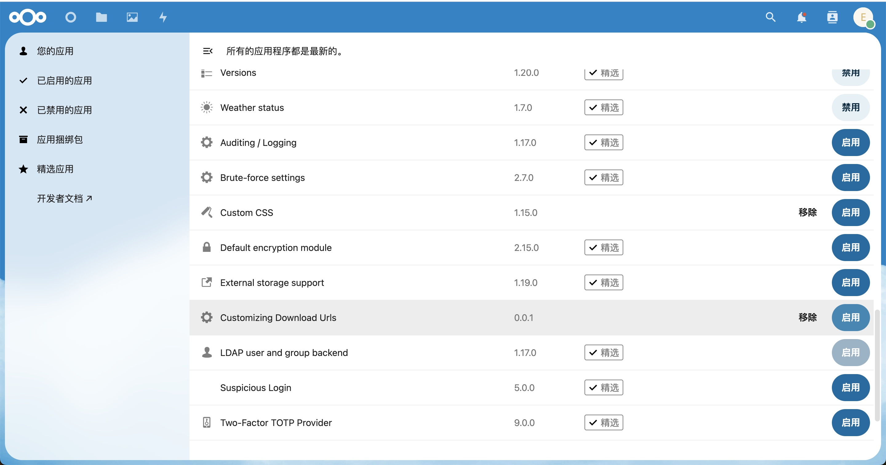
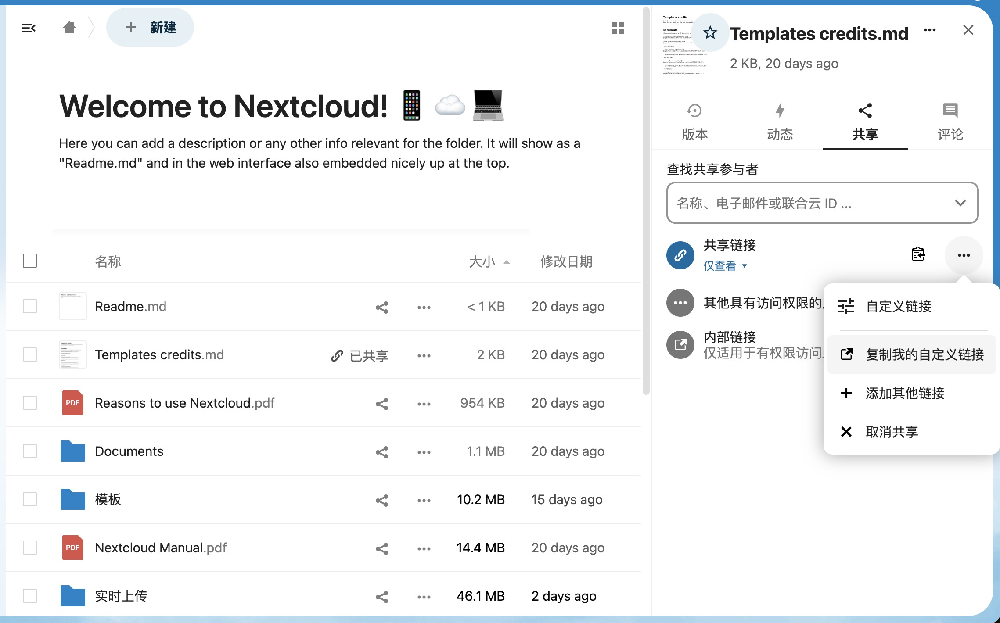
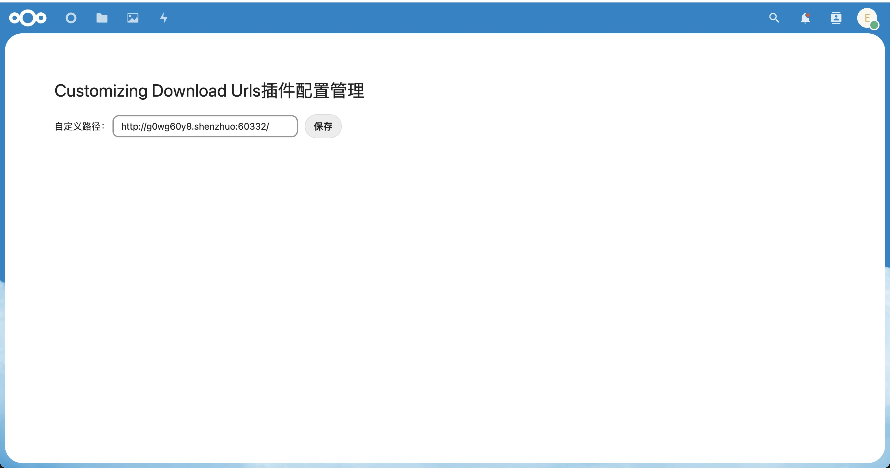

# Customizing Download Urls

一个自定义文件分享/下载链接的插件，用于解决在内网中使用nextcloud分享/下载文件时，链接以内网主机地址作为前缀的问题。

该插件的运行流程非常简单，将存储于服务器的链接读取，并与原有的分享链接拼接，然后复制到粘贴板。

注意，自定义链接必须可以通过公网访问，否则这么做没什么意义。

## 一、安装/启用插件

将插件跟目录中的“custom_url.example.txt”修改为“custom_url.txt”，并将整个插件放进nextcloud的app文件夹中，如：

> /var/www/html/nextcloud/apps

打开nextcloud插件管理面板中，并启用该插件。

（其实也可以直接在custom_url.txt文件中直接输入自定义链接，这样就不需要在插件管理面板处定义链接了）

## 二、使用插件

1、新增的菜单

启用插件后，将会在文件分享的下拉菜单中新增一个“复制我的自定义链接”选项，点击该按钮后，可将最终的文件分享/下载链接复制到粘贴板。

2、管理面板

在浏览器打开下方链接，可看到插件的管理界面。

> http://域名/nextcloud/index.php/apps/customizing_download_urls/

（界面比较简单，且仅包含一个保存链接的功能）

